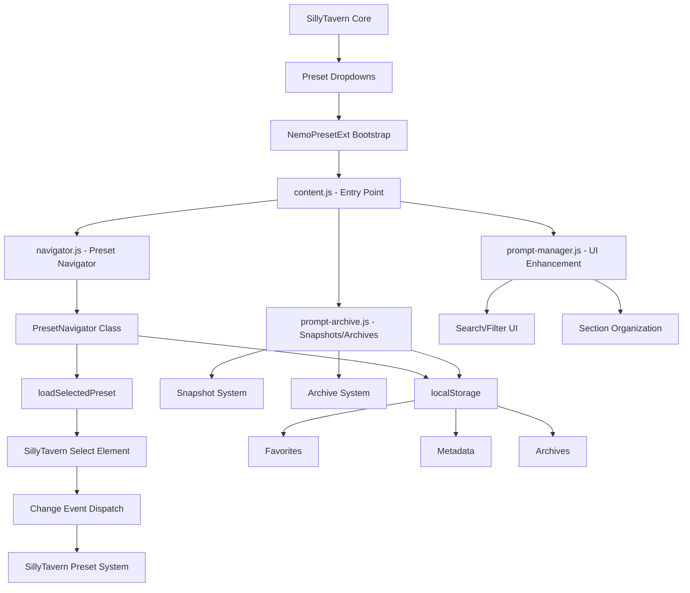

# NemoPresetExt - Chat Completion Presets Integration Documentation

## Overview

This document describes how the NemoPresetExt extension integrates with and manipulates Chat Completion presets in SillyTavern. The extension provides enhanced preset management through a navigator interface, favorites system, snapshots, archives, and folder organization while maintaining compatibility with SillyTavern's native preset system.

## Architecture Overview



## Entry Points and Responsibilities

### 1. Main Bootstrap (content.js)

**File:** `/content.js` (lines 27-168)

**Primary Responsibilities:**
- Waits for SillyTavern UI initialization via `waitForElement('#left-nav-panel')`
- Sets up MutationObserver to detect preset dropdowns for supported APIs
- Initializes all preset-related modules
- Manages event listeners for chat completion source changes

**Key Functions:**
- **Line 106-127:** Main observer that patches API preset dropdowns with "Browse..." buttons
- **Line 116:** Supported API list: `['openai', 'novel', 'kobold', 'textgenerationwebui', 'anthropic', 'claude', 'google', 'scale', 'cohere', 'mistral', 'aix', 'openrouter']`
- **Line 121:** Calls `initPresetNavigatorForApi(api)` for each detected dropdown
- **Line 136-151:** Event handler for `CHATCOMPLETION_SOURCE_CHANGED` that refreshes UI

### 2. Preset Navigator (navigator.js)

**File:** `/navigator.js` (lines 1-839)

**Primary Responsibilities:**
- Provides modal-based preset browsing with folder organization
- Manages favorites, import/export, and metadata
- Handles preset selection and application

**Key Classes and Functions:**

#### PresetNavigator Class (lines 6-783)
- **Constructor (lines 7-30):** Initializes navigator state, metadata, and UI references
- **loadSelectedPreset (lines 573-586):** Core preset application mechanism
- **importPreset (lines 675-705):** Handles preset file import via SillyTavern API
- **togglePresetFavorite (lines 707-725):** Manages favorite presets in localStorage

#### initPresetNavigatorForApi Function (lines 814-839)
- **Line 815:** Selector: `select[data-preset-manager-for="${apiType}"]`
- **Line 818:** Prevents double-patching with `dataset.nemoPatched`
- **Line 821-827:** Creates "Browse..." button that opens PresetNavigator modal
- **Line 832-835:** Creates favorites container below dropdown

### 3. Prompt Manager (prompt-manager.js)

**File:** `/prompt-manager.js` (lines 1-3105)

**Primary Responsibilities:**
- Enhances the native prompt manager UI with search, sections, and snapshots
- Provides prompt organization and manipulation features
- Integrates with SillyTavern's prompt system

**Key Functions:**
- **initialize (line ~111):** Sets up enhanced UI for prompt manager
- **createSearchAndStatusUI (lines 62-88):** Adds search controls and snapshot buttons
- **refreshUI (line ~142):** Refreshes prompt display when chat completion source changes

### 4. Prompt Archive (prompt-archive.js)

**File:** `/prompt-archive.js` (lines 1-590)

**Primary Responsibilities:**
- Manages prompt snapshots and archives
- Provides backup and restore functionality
- Stores archive data in extension settings

**Key Functions:**
- **createArchive (lines 48-81):** Creates archive from current prompt state
- **getCurrentPrompts (lines 83-97):** Reads prompt data from `window.oai_settings.prompts`
- **applyArchive (lines ~150-180):** Restores archived prompts to current state

## Data Models and Storage

### Preset Data Structure

Presets follow SillyTavern's native format, typically containing:
```json
{
  "temp": 0.7,
  "temperature": 0.7,
  "top_p": 1.0,
  "frequency_penalty": 0.0,
  "presence_penalty": 0.0,
  "stop_sequences": [],
  "max_tokens": 2048,
  "prompt_order": {},
  "prompts": []
}
```

### Extension Storage Locations

#### localStorage Keys
- **`nemo-favorite-presets`** (utils.js:15): Array of favorite preset names
- **`nemoNavigatorMetadata`** (utils.js:12): Folder organization and preset metadata
- **`nemoPromptSnapshotData`** (utils.js:11): Current prompt state snapshots
- **`nemoSectionsEnabled`** (utils.js:13): UI sections toggle state

#### Extension Settings
- **`extension_settings.NemoPresetExt.promptArchives`**: Archived prompt collections
- **`extension_settings.NemoPresetExt.*`**: Various extension configuration flags

### Metadata Structure
```json
{
  "folders": {
    "folder-id": {
      "id": "uuid",
      "name": "Folder Name",
      "parentId": "parent-uuid",
      "color": "#color",
      "createdAt": "ISO-date",
      "lastModified": "ISO-date"
    }
  },
  "presets": {
    "preset-name": {
      "folderId": "folder-uuid",
      "imageUrl": "data:image/...",
      "lastModified": "ISO-date"
    }
  }
}
```

## Event and Observer Wiring

### 1. DOM Mutation Observers

**Location:** content.js (lines 106-130)

**Target:** `document.body` with `{ childList: true, subtree: true }`

**Triggers:**
- Detects preset dropdown appearance: `#completion_prompt_manager_list`
- Detects API preset selectors: `select[data-preset-manager-for="${api}"]`

### 2. Event Sources

**SillyTavern Events:**
- **`CHATCOMPLETION_SOURCE_CHANGED`** (content.js:148): Triggers UI refresh
- **`OAI_PRESET_CHANGED_AFTER`** (prompt-archive.js:42): Available for auto-archiving
- **`NEMO_FAVORITES_UPDATED`** (navigator.js:720): Custom event for favorites changes

### 3. DOM Event Handlers

**Preset Application:**
```javascript
// navigator.js:577-578
select.value = this.selectedPreset.value;
select.dispatchEvent(new Event('change', { bubbles: true }));
```

**Favorites Loading:**
```javascript
// navigator.js:806-807
select.value = presetId;
select.dispatchEvent(new Event('change'));
```

## Preset Application Mechanism

### Direct Attachment Process

1. **Discovery Phase:**
   - MutationObserver detects `select[data-preset-manager-for="${apiType}"]` elements
   - `initPresetNavigatorForApi()` patches each dropdown with "Browse..." button

2. **Selection Phase:**
   - User opens PresetNavigator modal via "Browse..." button
   - Navigator loads preset list from SillyTavern's `openai_setting_names`
   - User selects preset via double-click or "Load Selected Preset" button

3. **Application Phase:**
   - `loadSelectedPreset()` finds the target select element
   - Sets `select.value = presetKey` where presetKey is the SillyTavern preset identifier
   - Dispatches `change` event with `{ bubbles: true }`
   - SillyTavern's native preset system handles the actual parameter application

### Value Propagation

The extension **does not directly manipulate** Chat Completion request parameters. Instead, it:
- Updates SillyTavern's preset selection UI
- Triggers SillyTavern's native preset loading mechanism
- Lets SillyTavern handle parameter injection into API requests

### Conflict Resolution

- **No conflict handling:** Extension relies on SillyTavern's native preset system
- **Single source of truth:** SillyTavern's `oai_settings` object remains authoritative
- **UI synchronization:** Extension reads from and writes to the same preset dropdowns

## Cross-Module Utilities

### Shared Constants (constants.js)
- **`SELECTORS.PROMPT_CONTAINER`**: `'#completion_prompt_manager_list'`
- **`TIMEOUTS.UI_REFRESH_DELAY`**: 500ms for post-change UI updates
- **`STORAGE_KEYS.EXTENSION_SETTINGS`**: `'NemoPresetExt'`

### Utility Functions (utils.js)
- **`generateUUID()`**: Creates unique identifiers for folders
- **`ensureSettingsNamespace()`**: Safely initializes extension settings
- **`debounce()`**: Used for search input handling

### Event Management
- **`eventSource`** from SillyTavern: Used for system-wide event communication
- **Custom events**: `NEMO_FAVORITES_UPDATED` for cross-component updates

## Import/Export Flows

### Import Process (navigator.js:675-705)
1. User selects JSON file via file input
2. File content validated (must contain `temp` or `temperature` field)
3. Check for existing preset name conflicts
4. Send to SillyTavern API: `POST /api/presets/save-openai?name=${name}`
5. Update local `openai_setting_names` and `oai_settings` objects
6. Refresh preset dropdown options

### Export Process
- Handled by SillyTavern's native export functionality
- Extension provides enhanced browsing but relies on core for export

## Favorites System

### Storage
- **Key:** `nemo-favorite-presets` in localStorage
- **Format:** Array of preset names (strings)
- **Persistence:** Survives extension reloads and browser restarts

### UI Integration
- **Favorites Container:** Added below each preset dropdown
- **Quick Access:** One-click preset loading from favorites
- **Visual Indicators:** Star icons in navigator interface

### Synchronization
- **Event-driven:** `NEMO_FAVORITES_UPDATED` event updates all favorites displays
- **Real-time:** Changes immediately reflected across all API dropdowns

## Snapshots and Archives

### Snapshots (prompt-manager.js)
- **Purpose:** Quick backup of current prompt state
- **Storage:** `nemoPromptSnapshotData` in localStorage
- **Scope:** Current chat's prompt configuration only

### Archives (prompt-archive.js)
- **Purpose:** Persistent prompt collections with metadata
- **Storage:** `extension_settings.NemoPresetExt.promptArchives`
- **Features:** Descriptions, timestamps, full prompt/system prompt data
- **API Access:** Reads from `window.oai_settings.prompts` and `window.oai_settings.prompt_order`

## Development Notes and Extension Points

### Adding New API Support
1. Add API name to supported list in content.js:116
2. Ensure SillyTavern uses `data-preset-manager-for="${apiType}"` pattern
3. No additional code required - automatic patching handles the rest

### Custom Preset Manipulation
```javascript
// To apply a preset programmatically:
const select = document.querySelector(`select[data-preset-manager-for="${apiType}"]`);
if (select) {
    select.value = presetKey;
    select.dispatchEvent(new Event('change', { bubbles: true }));
}
```

### Hooking Into Preset Changes
```javascript
// Listen for preset changes:
eventSource.on(event_types.OAI_PRESET_CHANGED_AFTER, (presetData) => {
    // Custom logic here
});
```

### Accessing Current Preset Data
```javascript
// Current preset settings:
const currentSettings = window.oai_settings;

// Available presets:
const availablePresets = window.openai_setting_names;

// Current prompts:
const currentPrompts = window.oai_settings.prompts;
```

### UI Extension Points
- **Preset Dropdown Enhancement:** Modify `initPresetNavigatorForApi()` in navigator.js
- **Prompt Manager Enhancement:** Extend `NemoPresetManager` in prompt-manager.js
- **Archive System:** Enhance `NemoPromptArchive` in prompt-archive.js

## Settings and Configuration

### Feature Flags
All major features can be toggled via extension settings:
- **`enableTabOverhauls`**: UI enhancements for settings tabs
- **`enableLorebookOverhaul`**: Enhanced world info management
- **`enableAnimatedBackgrounds`**: Background video/system
- **`nemoEnableExtensionsTabOverhaul`**: Extensions tab enhancements

### Storage Structure
```javascript
extension_settings.NemoPresetExt = {
    enableTabOverhauls: true,
    enableLorebookOverhaul: true,
    enableAnimatedBackgrounds: true,
    nemoEnableExtensionsTabOverhaul: true,
    promptArchives: { /* archive data */ },
    // ... other settings
}
```

## Summary

The NemoPresetExt extension integrates with SillyTavern's preset system through a non-invasive approach that:

1. **Observes** DOM changes to detect preset UI elements
2. **Enhances** existing UI with additional functionality
3. **Manipulates** preset selection through standard DOM events
4. **Stores** extension data separately from core preset data
5. **Leverages** SillyTavern's native APIs for all preset operations

This architecture ensures compatibility with SillyTavern updates while providing rich preset management capabilities including folder organization, favorites, snapshots, and archives.
